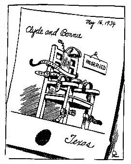

#+TITLE: Electric-Sentence mode

#+CAPTION: Some hoped Bonnie and Clyde would receive an electric sentence.  (Defunct Dallas Journal, Public domain, via Wikimedia Commons)

NOTE: This package works well but remains a work-in-progress.

* The point

This package reduces the amount of space-bar hammering you have to do after ending a sentence.  It allows you to (almost always) get away with hitting the space bar just once after a sentence.  That way you can focus more on the meaning of your text and stop abusing the ~SPC~ key.

It works when you insert a space and checks if you typed a question mark, exclamation mark, or period before the space.  If so, then it adds a second space for you.  But it makes an exception if you typed a period preceded by a recognized abbreviation.  In that case it will only leave the one space you typed, because you probably didn't mean to end the sentence if you just typed an abbreviation.

Of course, sometimes you will use an abbreviation that isn't recognized, and you will have to press ~M-SPC~ or ~DEL~ to ensure only one space after the period.  Or you might end a sentence with a recognized abbreviation and have to press ~SPC~ twice, like a commoner.

To predict a writer's intent to end a sentence would be very difficult without using some form of artificial intelligence.  So the goal of this package is merely to reduce the effort involved in clearly defining them, not to precisely anticipate them.

* Why you shouldn't set =sentence-end-double-space= to nil

By default, Emacs recognizes sentence-endings as a period (or a question mark or exclamation mark) followed by *two* spaces (or a newline).  This is a clear and unambiguous way to indicate where a sentence ends.

You can change that behavior by setting =sentence-end-double-space= to nil.  Then only a single space will be required to end a sentence.  However, if you do that, any abbreviation that ends with a period will be treated as the end of a sentence.  Some really nifty commands like =transpose-sentences= will then mangle sentences containing such abbreviations.  Other commands like =kill-sentence=, =forward-sentence=, and =backward-sentence= will be less convenient, requiring repeated invocations to move past abbreviations.

Exporting your text to other formats also might not work as well, since the sentence endings will be ambiguous.  Some formats, such as LaTeX, treat sentence endings in a typographically distinct way, inserting slightly more space (but not an entire second space) between them.  You might have extra space after abbreviations or too little space between sentences.

** The typographic-style argument

There are two counter-arguments to the =sentence-end-double-space= default.  The first is that two spaces between sentences is no longer stylistically favored.  It is a relic of the typewriter age.  It may invite scorn, causing readers to assume you are behind the times, clinging to an archaic habit.

But I view that as an unrelated concern.  It is about how your text is formatted as a finished product.  When you write text in Emacs, you separate content from typography.  The amount of space between sentences should not be considered at all during the drafting phase but only addressed in the export process or typesetting phase.

If you look at the raw text of this file, you'll see that every sentence is separated by two spaces.  But if you're reading it as rendered HTML on GitHub, you will not see any extra space between the sentences.

** The convenience argument

The second objection to the two-spaces between sentences default is more basic.  It is a hassle to press the space bar twice after every sentence.  It is annoying.  It /should/ be unnecessary to repeatedly slam the thumb against the space bar, twisting the wrist violently and potentially contributing to repetitive strain injuries.

That is exactly the problem this package seeks to solve.

* The solution

Why make it easier to insert two spaces?  Why not just set =sentence-end-double-space= to nil and write new commands that recognize sentences which *aren't* separated by two spaces?

Well, because that's hard.  Others have tried.  (Shout-out to noctuid, who wrote [[https://github.com/noctuid/emacs-sentence-navigation][emacs-sentence-navigation]] and many other great Emacs packages.)  It is easier and simpler to clearly demarcate sentence-endings in the first place.

Emacs already has built-in functionality for recognizing sentences that end with two spaces.  The simplest approach is to make it easier to use that.

It's not possible to come up with a perfect approach using a simple algorithm.  There are too many abbreviations that may or may not be used to end a sentence.  And many abbreviations that sometimes end a sentence, even if they usually don't.  Some manual interaction is necessary.  This package seeks to minimize that interaction in a way that is convenient.

* Related recommendations

1. Only add abbreviations you'll remember to =electric-sentence-abbrev-regexp=.

   That way it'll be easy to recognize when an abbreviation is not in your list, and you'll know to press ~M-SPC~ (=cycle-spacing=) to ensure a single space.  If you'll be using an abbreviation frequently in the future, then add it to the regexp.  The shorter the regexp is, the less you'll have to think about which abbreviations are included.

   Most writing doesn't contain many abbreviations.  "Mr.", "Ms.", "Mrs." and the street name suffixes should cover most casual writing.  Some domains will have more.  But of course, only those ending in a period need to be accounted for.  You don't need a perfectly comprehensive list.

2. Use =visual-line-mode= when writing prose.

   This avoids Emacs's paragraph filling, so that paragraphs contain no real line breaks.  There are many benefits to =visual-line-mode=, but most relevant for our purposes is that it prevents Emacs's paragraph-filling from adding sentence-endings you did not intend to have.

   For example, suppose your text has a paragraph which contains the sentence, "Mr. Smith spoke to Bob."  If your paragraph is ever formatted in such a way that "Mr." appears at the end of a line, then that will be treated as a sentence-ending which you obviously didn't intend.

   To be clear, Emacs attempts to prevent this when it fills paragraphs by not splitting words separated by only a period and a single space.  But it's easy to accidentally place an abbreviation at the end of a line.  And when that happens, the abbreviation will be treated as the end of a sentence in a way that you're less likely to notice (and therefore, unlikely to correct).  So for prose other than program comments, it's best to avoid paragraph-filling.

   Related to the above: if you don't like how visual lines wrap all the way at the right edge of the window, you can use [[https://codeberg.org/joostkremers/visual-fill-column][visual-fill-column]] or [[https://github.com/rnkn/olivetti][olivetti]] to make them wrap further away from the edge of the window, presenting narrower, easier to read paragraphs.  And the built-in =visual-wrap-prefix-mode= adds a nice touch for indented paragraphs, especially when used with =org-mode=.

3. Bind =electric-sentence-mode= to a key.

   There may be occasions, when you'd like to toggle =electric-sentence-mode=, such as when entering long citations, addresses, or other parts of text that contain unusual abbreviations.  To cover that case, you can bind =electric-sentence-mode= to a key, such as ~C-c s~.  (It would be nice to have a way to temporarily toggle the mode off in a way that it will automatically re-enable itself after pressing ~RET~ or some other key.  Human-crafted contributions are welcome.)

4. Remember the =repunctuate-sentences= command.

   If you have a buffer filled with sentences you previously wrote with =sentence-end-double-space= set to nil, you can easily fix it to have two spaces between sentences.  Just go to the top of the buffer, do ~M-x repunctuate-sentences RET~, and Emacs will iterate through what look like sentence endings, asking you to confirm whether to convert to two-spaces.  Just be sure to press ~n~ at each abbreviation that doesn't end a sentence.

* Alternative approaches

If there is another package that does the exact same thing, I am not aware of it.  But there are some other approaches to solving the =sentence-end-double-space= quandary.

1. Use exactly one sentence per line.

   This approach comes with some side benefits.  It lets you easily see the length of your sentences and how many there are.  It also lets you use Emacs's line-based commands for moving, transposing and killing sentences (including =org-mode='s ~M-<up>~ and ~M-<down>~ keybindings to move them).  I first learned of this idea from watching [[https://chrismaiorana.com/one-sentence-per-line/][Chris Maiorana]]'s videos on YouTube.  His channel and blog contain many other useful ideas.

   I tried this for a while and found that I prefer to see my text arranged as paragraphs.  Also, it's not visually pleasing on a narrow display, like a phone.  But Chris makes some good arguments in favor of this approach.  It's worth giving it a shot, especially if you like counting your sentences or being able to judge their length visually.

2. Don't worry about it.

   It's hard to believe, but some people just don't worry about this.  They set =sentence-end-double-space= to nil and don't even care that the =transpose-sentences= command no longer works reliably for them or that their original text has no unambiguous indicators of where sentences end.  That's okay, I guess.  ¯\_(ツ)_/¯

* ToDo

- [X] Finish converting =defvar= forms to =defcustom=.
- [ ] Make sure it works well with =electric-quote-mode=.
- [ ] Consider not just quotations that end a sentence, but also parentheticals?
- [ ] Make adding abbreviations stupid simple.
